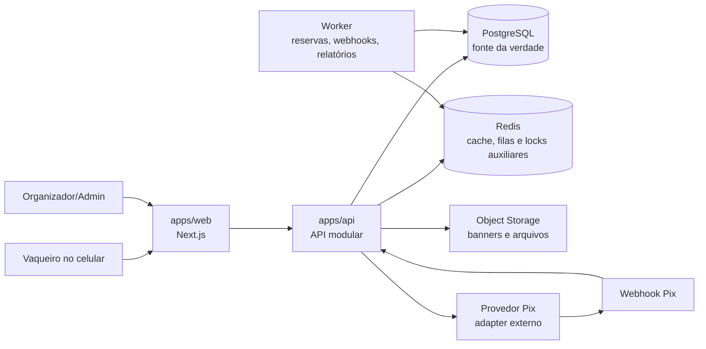
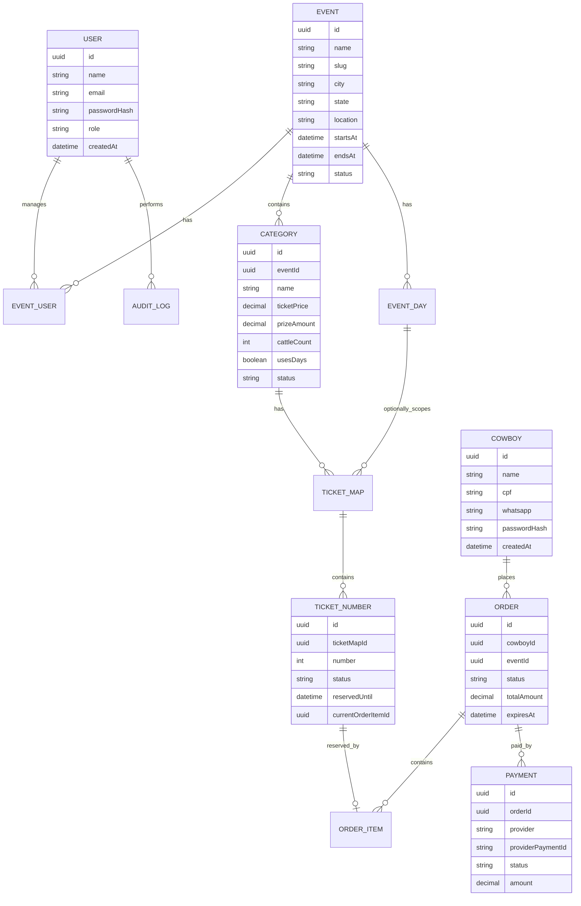
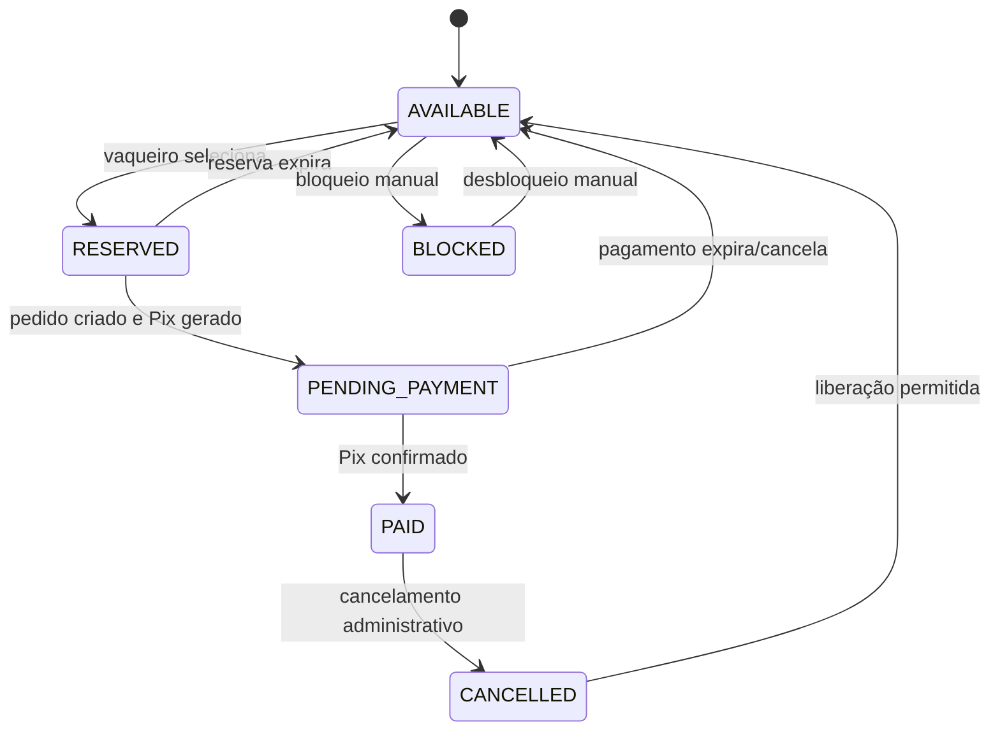

# Arquitetura Sugerida — Senha do Vaqueiro

Este documento consolida uma proposta de arquitetura para implementar o projeto **Senha do Vaqueiro**, com base no PRD e no design system existentes na raiz do repositório.

A recomendação principal é começar com uma arquitetura **modular, simples de operar e preparada para concorrência em compra de senhas**, evitando uma divisão prematura em muitos microsserviços. O ponto mais sensível do produto é impedir venda duplicada de senha durante picos de acesso e manter o status de pagamento Pix sincronizado com clareza para vaqueiro e organizador.

---

## 1. Visão Geral da Arquitetura

### Estilo recomendado

**Monorepo com frontend e backend separados, backend em monólito modular.**

Essa abordagem entrega boa organização sem aumentar demais a complexidade do MVP:

- Um frontend para o **Site do Vaqueiro** e a **Área Administrativa**.
- Uma API central com módulos bem separados por domínio.
- Banco relacional como fonte da verdade para senhas, pedidos e pagamentos.
- Fila/worker para tarefas assíncronas, expiração de reservas e confirmação de pagamentos.
- Design system compartilhado para manter consistência visual entre público e admin.

### Diagrama geral



---

## 2. Stack Recomendada

### Frontend

- **Next.js com App Router**
- **React + TypeScript**
- **Tailwind CSS**
- **shadcn/ui ou componentes próprios baseados em Radix UI**
- **Lucide React** para ícones
- **React Hook Form + Zod** para formulários e validação
- **TanStack Query** para chamadas à API, cache e revalidação
- **Playwright** para testes de fluxo real

Motivo: o design system já usa exemplos em TSX, tokens CSS, componentes como `Button`, `Input`, `StatusBadge`, `NumberMap` e recomenda Lucide. Next.js também facilita SEO das vaquejadas públicas e entrega boa experiência mobile.

### Backend

- **Node.js + NestJS** ou **Fastify modular**
- **TypeScript**
- **Prisma ORM**
- **PostgreSQL**
- **Redis + BullMQ** para filas e jobs
- **JWT em cookies HttpOnly** ou sessão segura para autenticação

Motivo: TypeScript compartilhado entre web, API e schemas reduz divergência entre frontend e backend. O backend deve ser modular, mas ainda implantado como uma aplicação única no MVP.

### Banco de Dados

- **PostgreSQL** como banco principal.
- Transações e bloqueios de linha para reserva de senhas.
- Índices por evento, categoria, dia, número, CPF e status.
- Constraints únicas para impedir duplicidade de número de senha no mesmo mapa.

### Infraestrutura inicial

- **Docker Compose local** com API, PostgreSQL, Redis e worker.
- Deploy inicial em VPS, Render, Railway, Fly.io ou similar.
- Frontend pode rodar junto ou separado, dependendo da hospedagem escolhida.
- Storage S3-compatible para banners, imagens e comprovantes/arquivos gerados.

---

## 3. Estrutura de Repositório

```txt
senha-do-vaqueiro/
  apps/
    web/
      app/
        (public)/
        (vaqueiro)/
        admin/
      components/
      features/
      lib/
      styles/
    api/
      src/
        modules/
        common/
        jobs/
        prisma/
        main.ts
  packages/
    ui/
      components/
      tokens/
    shared/
      schemas/
      types/
      constants/
    config/
      eslint/
      tsconfig/
  prisma/
    schema.prisma
    migrations/
    seed.ts
  docs/
    decisions/
  docker-compose.yml
  package.json
  pnpm-workspace.yaml
```

### Responsabilidade dos pacotes

| Pacote | Responsabilidade |
|---|---|
| `apps/web` | Site público, checkout, área do vaqueiro e admin |
| `apps/api` | Regras de negócio, autenticação, pagamentos, relatórios |
| `packages/ui` | Componentes visuais compartilhados e tokens do design system |
| `packages/shared` | Tipos, enums, schemas Zod e constantes de domínio |
| `packages/config` | Configuração compartilhada de TypeScript, lint e testes |
| `prisma` | Modelo de dados, migrations e seeds |

---

## 4. Aplicações e Rotas

### 4.1 Site do Vaqueiro

Rotas sugeridas:

```txt
/
/vaquejadas
/vaquejadas/[slug]
/comprar/[vaquejadaId]
/entrar
/cadastro-rapido
/minhas-senhas
/minhas-senhas/[senhaId]
```

Características:

- Mobile-first.
- Dark Mode Rodeio como identidade principal.
- Fluxo guiado de compra com etapas curtas.
- Não exigir cadastro antes de escolher categoria, dia e senha.
- CTA principal sempre claro: `Comprar senha`, `Escolher senha`, `Pagar com Pix`.

### 4.2 Área Administrativa

Rotas sugeridas:

```txt
/admin
/admin/vaquejadas
/admin/vaquejadas/nova
/admin/vaquejadas/[id]
/admin/vaquejadas/[id]/categorias
/admin/vaquejadas/[id]/dias
/admin/vaquejadas/[id]/mapa
/admin/vaquejadas/[id]/senhas
/admin/vaquejadas/[id]/pagamentos
/admin/vaquejadas/[id]/relatorios
/admin/usuarios
/admin/configuracoes
```

Características:

- Light Mode Arena como padrão.
- Layout com sidebar em desktop e navegação simples no mobile.
- Tabelas com filtros no admin.
- Cards no público e na área do vaqueiro.
- Relatórios simples no MVP, exportáveis depois.

---

## 5. Módulos do Backend

### `AuthModule`

Responsável por autenticação e autorização.

- Login de administrador/organizador.
- Login do vaqueiro com CPF e senha.
- Cadastro rápido do vaqueiro.
- Recuperação de senha em versão futura.
- Emissão e renovação de sessão.

### `UsersModule`

Responsável por usuários internos.

- Administradores do sistema.
- Organizadores/parques.
- Vínculo de organizador com vaquejada.
- Controle de permissões por papel.

### `CowboysModule`

Responsável pelos vaqueiros.

- Cadastro rápido.
- Perfil do vaqueiro.
- Normalização e validação de CPF/WhatsApp.
- Consulta de senhas próprias.

### `EventsModule`

Responsável pelas vaquejadas.

- Cadastro e edição de vaquejada.
- Status: `DRAFT`, `ACTIVE`, `ENDED`, `CANCELLED`.
- Publicação de evento somente quando possuir categoria e mapa válido.
- Controle de banner, cidade, estado, local e período.

### `CategoriesModule`

Responsável pelas categorias de uma vaquejada.

- Nome, valor, premiação, quantidade de bois e observações.
- Status ativo/inativo.
- Regra de organização por dia.

### `EventDaysModule`

Responsável pelos dias de apresentação.

- Cadastro de dias por vaquejada.
- Vínculo opcional entre categoria e dia.
- Suporte a categoria com e sem organização por dia.

### `TicketMapModule`

Responsável pelo mapa de senhas.

- Criação de intervalo de senhas.
- Bloqueio manual de números.
- Consulta rápida de disponibilidade.
- Status da senha: `AVAILABLE`, `RESERVED`, `PENDING_PAYMENT`, `PAID`, `CANCELLED`, `BLOCKED`.

### `CheckoutModule`

Responsável pelo fluxo de compra.

- Seleção de uma ou mais senhas.
- Reserva transacional de números.
- Criação de pedido.
- Associação do pedido ao vaqueiro.
- Geração do Pix via módulo de pagamento.

### `PaymentsModule`

Responsável por pagamentos Pix.

- Adapter para provedor Pix.
- Geração de cobrança Pix.
- Recebimento de webhook.
- Idempotência de eventos externos.
- Atualização de pagamento e senhas.
- Expiração de cobrança.

### `ReportsModule`

Responsável por indicadores e relatórios.

- Dashboard por vaquejada.
- Vendas por categoria.
- Vendas por dia.
- Receita confirmada e pendente.
- Exportação CSV/PDF em etapa posterior.

### `AuditModule`

Responsável por rastreabilidade.

- Registrar ações administrativas.
- Registrar alteração manual em senhas.
- Registrar cancelamentos, bloqueios e edição de dados sensíveis.

---

## 6. Modelo de Dados Inicial

### Entidades principais



### Tabelas sugeridas

| Tabela | Observação |
|---|---|
| `users` | Admins e organizadores |
| `cowboys` | Vaqueiros, login por CPF |
| `events` | Vaquejadas |
| `event_users` | Permissões de organizadores por vaquejada |
| `categories` | Categorias de cada vaquejada |
| `event_days` | Dias opcionais da vaquejada |
| `category_days` | Vínculo N:N se uma categoria puder correr em dias específicos |
| `ticket_maps` | Mapa por categoria e opcionalmente por dia |
| `ticket_numbers` | Cada número de senha com status próprio |
| `orders` | Pedido de compra |
| `order_items` | Senhas dentro do pedido |
| `payments` | Cobranças Pix e status |
| `payment_events` | Webhooks recebidos, com idempotência |
| `audit_logs` | Ações administrativas importantes |

### Constraints importantes

- `events.slug` único.
- `ticket_numbers(ticket_map_id, number)` único.
- `payments(provider, provider_payment_id)` único.
- `payment_events(provider, external_event_id)` único.
- CPF normalizado único em `cowboys`.
- Organizador só acessa eventos presentes em `event_users`.

---

## 7. Máquina de Estados

### Status da senha



### Status do pedido

```txt
DRAFT -> WAITING_PAYMENT -> PAID
WAITING_PAYMENT -> EXPIRED
WAITING_PAYMENT -> CANCELLED
WAITING_PAYMENT -> PAYMENT_FAILED
```

### Status do pagamento

```txt
WAITING_PAYMENT
PAID
EXPIRED
CANCELLED
FAILED
```

---

## 8. Fluxo Crítico de Compra

### 8.1 Seleção e reserva de senhas

O fluxo de reserva deve ser transacional para evitar venda duplicada.

Passos recomendados:

1. Frontend envia `eventId`, `categoryId`, `dayId` opcional e lista de números.
2. API abre uma transação no PostgreSQL.
3. API busca os `ticket_numbers` com bloqueio de linha.
4. API valida se todos estão `AVAILABLE`.
5. API muda status para `RESERVED` ou `PENDING_PAYMENT`.
6. API cria `order` e `order_items`.
7. API grava `reservedUntil`/`expiresAt`.
8. API confirma a transação.
9. API gera cobrança Pix.
10. Frontend exibe QR Code, copia e cola Pix e tempo restante.

Se uma senha ficar indisponível durante a compra, a mensagem deve ser simples:

> Essa senha acabou de ser selecionada por outra pessoa.

### 8.2 Expiração da reserva

Um worker deve rodar periodicamente:

- Procurar pedidos `WAITING_PAYMENT` vencidos.
- Confirmar com o provedor, quando necessário.
- Marcar pagamento como `EXPIRED`.
- Liberar senhas para `AVAILABLE`, se ainda não pagas.

### 8.3 Confirmação Pix

O webhook do provedor Pix deve:

- Validar assinatura/origem.
- Registrar evento em `payment_events`.
- Ignorar evento duplicado.
- Atualizar `payments.status`.
- Atualizar `orders.status`.
- Atualizar `ticket_numbers.status` para `PAID`.
- Emitir notificação interna para o frontend atualizar a tela, se houver realtime.

---

## 9. API Sugerida

### Públicas

```txt
GET    /events
GET    /events/:slug
GET    /events/:id/categories
GET    /categories/:id/days
GET    /ticket-maps/:id/numbers
```

### Autenticação do vaqueiro

```txt
POST   /cowboys/register
POST   /cowboys/login
POST   /cowboys/logout
GET    /cowboys/me
```

### Checkout

```txt
POST   /checkout/reserve
POST   /checkout/:orderId/identify
POST   /checkout/:orderId/payment
GET    /checkout/:orderId
POST   /checkout/:orderId/cancel
```

### Área do vaqueiro

```txt
GET    /me/tickets
GET    /me/tickets/:id
PATCH  /me/tickets/:id
GET    /me/tickets/:id/print
```

### Admin

```txt
POST   /admin/auth/login
GET    /admin/events
POST   /admin/events
PATCH  /admin/events/:id
POST   /admin/events/:id/publish

GET    /admin/events/:id/categories
POST   /admin/events/:id/categories
PATCH  /admin/categories/:id

GET    /admin/events/:id/days
POST   /admin/events/:id/days

POST   /admin/categories/:id/ticket-maps
GET    /admin/events/:id/tickets
PATCH  /admin/tickets/:id
POST   /admin/tickets/:id/block
POST   /admin/tickets/:id/unblock

GET    /admin/events/:id/dashboard
GET    /admin/events/:id/reports
GET    /admin/events/:id/payments
```

### Webhook Pix

```txt
POST   /webhooks/payments/:provider
```

---

## 10. Autorização e Segurança

### Papéis

| Papel | Acesso |
|---|---|
| `SYSTEM_ADMIN` | Todos os eventos, usuários, mapas e relatórios |
| `ORGANIZER` | Apenas vaquejadas vinculadas |
| `COWBOY` | Apenas suas próprias senhas e pedidos |

### Regras obrigatórias

- CPF sempre normalizado antes de salvar ou buscar.
- Senhas armazenadas com hash forte.
- Cookies HttpOnly/Secure em produção.
- Rate limit em login, cadastro rápido e checkout.
- Logs de auditoria em ações administrativas críticas.
- Dados sensíveis mascarados em telas administrativas quando não forem necessários.
- Webhook Pix com verificação de assinatura, token ou segredo.
- Operações de compra sempre no backend, nunca confiando no status vindo do frontend.

---

## 11. Arquitetura Visual e UI

### Organização no frontend

```txt
apps/web/
  app/
    (public)/
      page.tsx
      vaquejadas/
    (vaqueiro)/
      minhas-senhas/
    admin/
      layout.tsx
      page.tsx
  features/
    events/
    checkout/
    tickets/
    payments/
    admin-dashboard/
  components/
    layout/
    feedback/
  lib/
    api-client.ts
    auth.ts
```

### Componentes essenciais do MVP

- `EventCard`
- `CategoryBadge`
- `StatusBadge`
- `NumberMap`
- `TicketNumber`
- `CheckoutStepper`
- `CheckoutSummary`
- `PaymentStatus`
- `PixPaymentBox`
- `TicketCard`
- `AdminStatsCard`
- `DataTable`
- `FilterBar`
- `FormDrawer`
- `ConfirmDialog`

### Direção de tema

- Público: **Dark Mode Rodeio**.
- Admin: **Light Mode Arena**.
- Tokens do design system devem virar CSS variables e presets Tailwind.
- Evitar cores hardcoded como `orange-500`; usar `bg-primary`, `text-foreground`, `border-border`.

---

## 12. Relatórios e Impressão

### MVP

- Dashboard por evento com totais.
- Filtros por categoria, dia e status.
- Impressão individual de senha.
- Lista administrativa exportável para CSV em etapa simples.

### Evolução

- PDF de relatório por vaquejada.
- Impressão em lote.
- QR Code de validação.
- Check-in no evento.

---

## 13. Observabilidade e Operação

### Logs importantes

- Tentativas de compra.
- Falhas de reserva por concorrência.
- Criação de Pix.
- Webhooks recebidos.
- Pedidos expirados.
- Alterações manuais em senha.

### Métricas importantes

- Taxa de conclusão da compra.
- Tempo médio até pagamento.
- Senhas reservadas expiradas.
- Falhas de webhook.
- Erros por rota.
- Quantidade de vendas por evento durante pico.

### Alertas

- Webhook Pix falhando.
- Fila parada.
- Alto número de reservas expiradas.
- Erro no checkout.
- Banco com locks demorados.

---

## 14. Estratégia de Testes

### Testes unitários

- Regras de status de senha.
- Cálculo de total do pedido.
- Validação de CPF/WhatsApp.
- Permissões de usuário.
- Transições de pagamento.

### Testes de integração

- Reserva de senha com transação.
- Compra de múltiplas senhas.
- Webhook Pix idempotente.
- Expiração de pedido.
- Organizador sem permissão tentando acessar evento alheio.

### Testes E2E

- Vaqueiro compra uma senha.
- Vaqueiro compra múltiplas senhas.
- Pagamento pendente aparece em `Minhas senhas`.
- Webhook simulado confirma pagamento.
- Organizador visualiza venda no dashboard.
- Admin cadastra evento, categoria e mapa.

### Teste de concorrência obrigatório

Simular dois usuários tentando comprar a mesma senha ao mesmo tempo. Apenas um pedido pode reservar/pagar a senha; o outro deve receber erro amigável.

---

## 15. Plano de Implementação do MVP

### Fase 1 — Fundação

- Criar monorepo.
- Configurar `apps/web`, `apps/api`, `packages/ui`, `packages/shared`.
- Configurar PostgreSQL, Redis, Prisma e Docker Compose.
- Implementar tokens do design system.
- Criar autenticação base para admin e vaqueiro.

### Fase 2 — Administração de vaquejadas

- CRUD de vaquejadas.
- CRUD de categorias.
- Cadastro opcional de dias.
- Geração de mapa de senhas por intervalo.
- Vínculo de organizadores à vaquejada.
- Publicação do evento somente com configuração mínima válida.

### Fase 3 — Site público e checkout

- Listagem de vaquejadas ativas.
- Detalhe da vaquejada.
- Fluxo guiado: categoria, dia, senhas, identificação, resumo.
- Reserva transacional de senhas.
- Cadastro rápido e login por CPF.

### Fase 4 — Pix e área do vaqueiro

- Adapter do provedor Pix.
- Geração de QR Code/copia e cola.
- Tela de pagamento aguardando confirmação.
- Webhook de confirmação.
- Área `Minhas senhas`.
- Visualização/impressão individual da senha.

### Fase 5 — Organizador e relatórios

- Dashboard da vaquejada.
- Lista de senhas com filtros.
- Consulta de pagamentos.
- Edição administrativa controlada.
- Impressão de senha.
- Relatórios básicos.

---

## 16. Decisões Técnicas Recomendadas

| Tema | Decisão |
|---|---|
| Arquitetura | Monorepo + API modular |
| Frontend | Next.js, TypeScript, Tailwind |
| UI | Design system próprio baseado nos tokens existentes |
| Backend | API TypeScript modular |
| Banco | PostgreSQL |
| ORM | Prisma |
| Fila | BullMQ + Redis |
| Pagamento | Adapter Pix isolado por provedor |
| Autorização | RBAC por papel + vínculo por vaquejada |
| Concorrência | Transação no banco + lock de linha |
| Deploy MVP | Docker com API, worker, Postgres e Redis |

---

## 17. Pontos de Atenção

### Concorrência no mapa de senhas

Esse é o maior risco técnico do produto. A disponibilidade exibida no frontend é apenas informativa. A confirmação real precisa acontecer no backend, dentro de uma transação.

### Webhook de pagamento

Webhooks podem chegar duplicados, atrasados ou fora de ordem. Por isso, o sistema precisa registrar eventos externos e processá-los com idempotência.

### Simplicidade para o vaqueiro

O fluxo público deve evitar telas longas. A arquitetura de frontend deve favorecer etapas pequenas e mensagens claras.

### Relatórios

No MVP, relatórios podem ser consultas agregadas diretas. Se o volume crescer, criar tabelas/materializações para indicadores.

### Edição de senha

Nem todo dado deve ser editável depois do pagamento. A regra deve morar no backend, idealmente em uma configuração por evento/categoria.

---

## 18. Próximos Artefatos Recomendados

Após esta arquitetura, os próximos documentos úteis seriam:

- Modelo ERD detalhado com todos os campos.
- ADR de escolha do provedor Pix.
- Especificação dos endpoints do MVP.
- Checklist de aceite por fase.
- Protótipo navegável das telas principais.
- Plano de testes de concorrência para abertura de vendas.

---

## 19. Resumo Executivo

A melhor arquitetura para o **Senha do Vaqueiro** é uma plataforma web mobile-first com frontend Next.js, API modular em TypeScript, PostgreSQL como fonte da verdade e Redis/worker para tarefas assíncronas. O sistema deve ser simples no uso, mas rigoroso na reserva de senhas e confirmação Pix.

O MVP deve priorizar:

- Cadastro completo de vaquejada, categorias, dias e mapas.
- Compra guiada de senha no celular.
- Reserva transacional para evitar duplicidade.
- Pagamento Pix com webhook idempotente.
- Área do vaqueiro para consultar senhas.
- Painel do organizador com lista, filtros, impressão e indicadores básicos.

Essa base permite entregar rápido sem travar a evolução futura para WhatsApp, QR Code, check-in, repasses financeiros, cupons e páginas personalizadas por parque.
